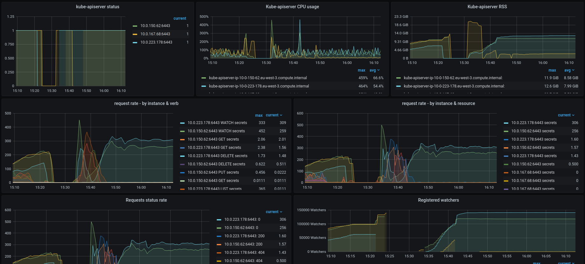
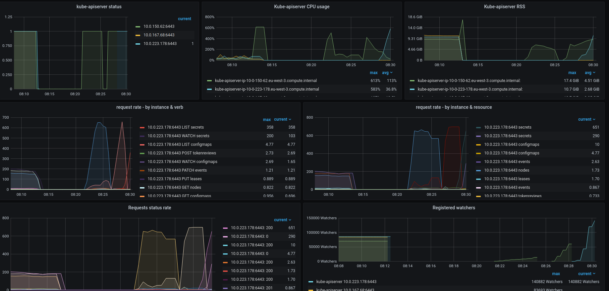
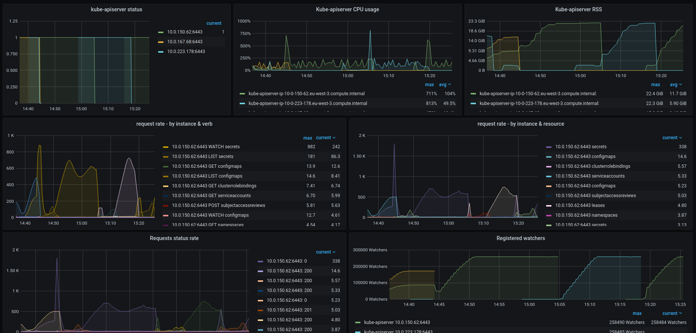

# API priority & Fairness watch experiments

The content of this repository is meant to validate the new P&F for WATCH requests feature recently [merged in vanilla K8S](https://github.com/openshift/kubernetes/pull/783) and OpenShift.
The procedure to test this feature consists of deploying a series of pods each of them mounting a high number of secrets (200 in this case), the mounting of this secrets leads to kubelet to create a watcher against the API.

## Cluster sizing

The experiment was performed in a AWS based cluster with the following node sizes:

- 3x m5.2xlarge (8 vCPU + 32 GiB)
- 15x m5.xlarge worker nodes: (4 vCPU + 16 GiB): The number of worker nodes is important due to client-side throttling.

## Considerations

- Kubelet's FlowSchema is `system-nodes`
- This FlowSchema is configured with PriorityLevel `system` which has `assuredConcurrencyShares` set to 30. This means that ACV (Assured concurrency value) is roughly ~600 in each instance (ceil(SCL * ACS(l) / (sum[priority levels k] ACS(k)))) (where SCL is 3000), this value has resulted in being very high to the deployed master nodes.
- In OpenShift default max-requests-inflight and max-mutating-requests-inflight are configured to 3000 and 1000 respectively
- Kubelet's QPS/Burst values are set to 50/100. This leads that a 15 worker node cluster can generate 750 rps at most due to client throttling. (Note the kubelet instances running in the control plane)

## Methodology

In order to verify how p&f can help to improve cluster's stability in case of a WATCH requests storm, first we need to confirm that the only kube-apiserver instance is not able to handle a big amount of WATCH requests in a short time period. This request storm performing the following steps:

- Disable p&f FeatureGate with:

```shell
oc patch kubeapiserver cluster --type=merge -p '{"spec":{"unsupportedConfigOverrides":{"apiServerArguments":{"feature-gates":["APIPriorityAndFairness=true"]}}}}'
```

- Create 1500 pods (across 150 namespaces) mounting 200 secrets each, to make a total of 30000 secrets which is translated into ~300000 watchers (1500 pods * 200 secrets each)

```shell
kube-burner init -c apf-watch.yml --uuid $(uuidgen)
```

- Rollout (kill) two kube-apiserver instances, all the established watches are redirected to the remaining instance.

```shell
mv /etc/kubernetes/manifests/kube-apiserver-pod.yaml ~ && pkill -9 kube-apiserver
```

- Verify that the remaining kube-apiserver instance enters in a crashloop state as is not able to handle such amount or requests.

The previous behaviour is considerably mitigated after enabling p&f and tuning some kube-apiserver flags.

## Results

- 150 namespaces with 10 pods each, mounting 200 secrets: P&F off.
https://snapshot.raintank.io/dashboard/snapshot/HJp21ktTfko97435rkAZkIIqCjDExllS
As soon as we kill the second instance, the remaining went down. The API remained unavailable until the other kube-apiserver instances came back.



https://snapshot.raintank.io/dashboard/snapshot/vC5R3Op03Gr4R13kffSTQgiPdV2vkDko
The instance .62 entered in crashloop state until one of the other instances came back.



- 150 namespaces with 10 pods each, mounting 200 secrets: P&F on. AssuredConcurrencyShares in *system* 1. max-requests-inflight and max-mutating-requests-inflight: 750 and 250 respectively
https://snapshot.raintank.io/dashboard/snapshot/Unb4VtK3XHDyUkH5eUrPvj22Z1kJJkTI

This test was repeated 3 times to verify the results are stable. We can see some queueing and rejections each time we kill the instance holding most of the watchers.




## Takeaways

- Default max-requests-inflight and max-mutating-requests-inflight are too high for a master node of this size. Even after decreasing AssuredConcurrencyShares to 1, kube-apiserver wasn't able to support such number of concurrent requests. (22). These defaults values are meant for **huge** control plane nodes,and does not allow to take advante of the benefits P&F provides.

- Killing one of the instances leads to a high number number of requests using the flowSchema serviceaccounts (audit logs show a high number of these requests from the operators of the cluster). This spike sometimes creates a metrics collection gap in the kube-apiserver instance: https://snapshot.raintank.io/dashboard/snapshot/scgN9vtMOEhtdJC7W3fduuf7N8nNRdZ6

- It's very common to observe metric collection gaps (As shown in the graphs) in the API receiving the request storm.

- It's important to note the peak of requests using the flowSchema `service-accounts` which is used by all cluster operators of the cluster.
